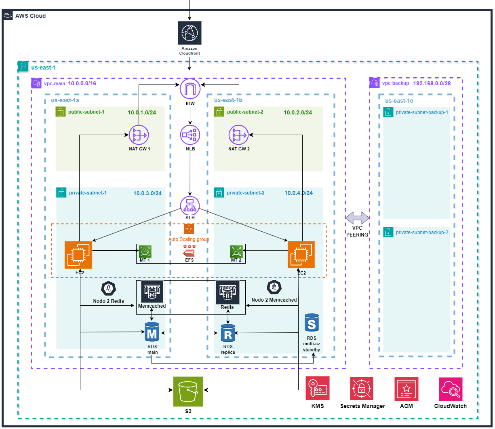

# Lab04: Terraform - Álvaro Cascajosa Fernández

Este repositorio contiene el trabajo realizado con [Terraform](https://www.terraform.io/) para el Laboratorio 4. 

## Diagrama de Arquitectura



## Tabla de Contenidos

1. [Descripción General](#descripción-general)
2. [Arquitectura y Servicios principales](#arquitectura-y-servicios)
    - [VPC Principal y Subredes](#vpc-principal-y-subredes)
    - [VPC para Backups](#vpc-para-backups)
    - [Balanceadores de Carga](#balanceadores-de-carga)
    - [Base de Datos RDS](#base-de-datos-rds)
    - [Almacenamiento S3](#almacenamiento-s3)
    - [Sistema de Archivos EFS](#sistema-de-archivos-efs)
    - [Memcached y Redis](#memcached-y-redis)
    - [Cifrado y Gestión de Secretos](#cifrado-y-gestión-de-secretos)
    - [Certificados SSL/TLS](#certificados-ssltls)
    - [Seguridad y Control de Acceso](#seguridad-y-control-de-acceso)
3. [Escalado Automático y Alarmas](#escalado-automático-y-alarmas)
    - [Launch Template](#lauch-template)
    - [Auto Scaling Group (ASG)](#auto-scaling-group-asg)
4. [CloudFront y Route53](#cloudfront-y-route53)
5. [Monitoreo](#monitoreo)
6. [Variables de Configuración](#variables-de-configuración)
7. [Cómo Ejecutar](#cómo-ejecutar)
8. [Conclusiones](#conclusiones)

## Descripción General

El objetivo de esta infraestructura es desplegar una aplicación WordPress de manera totalmente automatizada en AWS, sin requerir de configuración adicional.

La arquitectura incluye la configuración de una VPC principal con subredes públicas y privadas y sus respectivos NAT Gateways y tablas de rutas, una VPC para backups conectada mediante VPC peering, balanceadores de carga (NLB externo y ALB interno), una base de datos RDS multi-az y con réplica de lectura, almacenamiento S3, Memcached (para caché de sesiones), Redis (como sistema de caché general) y un sistema de archivos EFS compartido entre las instancias. Además, se implementa escalado automático, CloudFront y Route53, y se configura el monitoreo de la infraestructura. Por último, se establece SSL end-to-end mediante certificado auto-firmado.

Por tanto, se trata de una infraestructura con alta disponibilidad, seguridad, almacenamiento persistente y capacidad de recuperación ante desastres.

## Arquitectura y Servicios Principales

### VPC Principal y Subredes

- **VPC Principal**: Se implementa una VPC con CIDR `10.0.0.0/16`, que contiene subredes públicas y privadas distribuidas en múltiples zonas de disponibilidad.


- **Subredes Públicas**:

  - **us-east-1a:** `10.0.1.0/24`
  - **us-east-1a:** `10.0.2.0/24`

  Función principal: Alojar el Network Load Balancer y NAT Gateways.


- **Subredes Privadas**:

  - **us-east-1a:** `10.0.3.0/24`
  - **us-east-1a:** `10.0.4.0/24`

  Función principal: Alojar instancias EC2, el Application Load Balancer y los servicios internos, como RDS y ElastiCache.


- **Internet Gateway (IGW)**: Asociado con la VPC principal, proporciona acceso a Internet a las subredes públicas.


- **NAT Gateways**: Configurados en las subredes públicas para permitir que las instancias en subredes privadas puedan acceder a Internet de manera segura (por ejemplo, para actualizaciones o acceso a servicios externos), sin exponerlas directamente a Internet.


### VPC para Backups

Una segunda VPC (`10.1.0.0/16`) actúa como red dedicada para operaciones de respaldo. Se establece una conexión **VPC Peering** con la VPC principal, lo que permite transferir datos de forma segura para almacenar backups mediante el servicio AWS Backup y un bucket S3 dedicado.

---

### Balanceadores de Carga

#### Network Load Balancer (NLB)

- **Función**: Balancea el tráfico entrante y distribuye las solicitudes hacia el Application Load Balancer en las subredes privadas.
- **Configuración**: Implementado en las subredes públicas para recibir tráfico de entrada por puerto 443.

#### Application Load Balancer (ALB)

- **Función**: Distribuye el tráfico entre las instancias de las aplicaciones dentro de las subredes privadas.
- **Configuración**: Asigna el tráfico de aplicaciones de acuerdo con las reglas de balanceo configuradas, mejorando la eficiencia y distribuyendo la carga.

---

### Base de Datos RDS

- **Instancia RDS**: Se despliega una base de datos MySQL con alta disponibilidad usando Multi-AZ. La configuración incluye una réplica de lectura para mejorar el rendimiento en consultas de solo lectura.
- **Backups**: Configurada para respaldos automáticos y recuperación ante desastres.
- **CIDR**: Ubicada en la subred privada de la VPC principal (`10.0.3.0/24` y `10.0.4.0/24`).

---

### Almacenamiento S3

- **Bucket de S3**: Proporciona almacenamiento seguro y persistente para datos estáticos y archivos de configuración. El bucket está configurado con:
  - **Versionado**: Habilitado para mantener múltiples versiones de objetos.
  - **Bloqueo de acceso público**: Protege el acceso no autorizado, permitiendo solo accesos internos.

---

### Sistema de Archivos EFS

- **Amazon EFS**: Proporciona un sistema de archivos compartido accesible desde instancias en las subredes privadas (`10.0.3.0/24` y `10.0.4.0/24`), adecuado para almacenar datos compartidos entre varias instancias.

----

### Memcached y Redis

#### Cluster de Memcached
- **Función**: Almacena en caché datos de sesión.
- **Configuración**: Implementado en las subredes privadas, asegurando una baja latencia para consultas internas.

#### Cluster Redis
- **Función**: Funciona como sistema de caché principal, almacenando datos persistentes y permite operaciones transaccionales.
- **Configuración**: Cluster Redis distribuido en varias zonas de disponibilidad para mejorar la tolerancia a fallos.

---

### Cifrado y Gestión de Secretos

#### KMS (AWS Key Management Service)

AWS KMS proporciona un sistema de gestión de claves que facilita el cifrado y desencriptado de datos de forma segura. En esta arquitectura, AWS KMS se utiliza para:

- **Cifrado de Credenciales de la Base de Datos**: Se utiliza una KMS como clave de cifrado del secreto almacenado en AWS Secrets Manager, que contiene las credenciales de la base de datos. La clave KMS utilizada para desencriptar las credenciales de la snapshot de RDS (desde la que se genera la BD) es privada. La utilización de otra clave implicaría modificar el código, no utilizando la snapshot como base y por tanto, perdiendo parte de la configuración de WP.

AWS KMS permite la rotación automática de claves y provee controles de acceso mediante políticas de IAM, lo que permite que solo usuarios y roles específicos puedan administrar o usar las claves.

#### AWS Secrets Manager

AWS Secrets Manager facilita la gestión de credenciales y secretos de forma segura y centralizada, permitiendo que las aplicaciones puedan acceder a contraseñas, claves API y otras credenciales de manera programática. En esta infraestructura, Secrets Manager se usa para:

- **Almacenamiento de Credenciales de Base de Datos**: Las credenciales de acceso para el RDS (por ejemplo, el nombre de usuario y la contraseña) se almacenan en Secrets Manager, permitiendo que las aplicaciones accedan a la base de datos de manera segura.
  
- **Rotación Automática de Secretos**: Secrets Manager permite configurar la rotación automática de las credenciales. Esto asegura que las contraseñas se actualicen periódicamente sin intervención manual, mejorando la seguridad de la infraestructura.

- **Control de Acceso a Secretos**: Solo los servicios y usuarios con permisos explícitos en IAM pueden acceder a los secretos. Esto evita que personas o aplicaciones sin autorización puedan visualizar o utilizar las credenciales almacenadas en Secrets Manager.

---

### Certificados SSL/TLS

#### AWS Certificate Manager (ACM)

AWS ACM permite gestionar certificados SSL/TLS para los dominios asociados a esta infraestructura, asegurando que las conexiones a los servicios web sean seguras (HTTPS). En esta arquitectura, ACM se utiliza para:

- **Importación y Asignación de Certificados al ALB**: ACM permite importar certificados SSL/TLS (en este caso, auto-firmados) y asignarlos al Application Load Balancer (ALB) permitiendo que el tráfico entre los usuarios y la aplicación esté cifrado y protegiendo la información transmitida.

- **Compatibilidad con HTTPS en CloudFront**: ACM también se usa para habilitar HTTPS en la distribución de CloudFront, permitiendo que el contenido entregado por CloudFront esté cifrado durante la transmisión.

ACM simplifica la gestión de certificados y mejora la seguridad de las conexiones al no requerir intervención manual en la generación y renovación de los certificados SSL/TLS.

---

### Seguridad y Control de Acceso

#### Security Groups

Los Security Groups actúan como firewalls virtuales que controlan el tráfico entrante y saliente de los recursos en la VPC. En esta arquitectura, cada componente crítico tiene Security Groups anidados a otros Security Groups, restringiendo así el tráfico no autorizado y mejorando la seguridad de la infraestructura. Los Security Groups utilizados en esta arquitectura incluyen:

- **Security Group para el NLB**: Acepta tráfico HTTPS entrante desde el exterior (internet) y redirige las solicitudes al ALB.

- **Security Group para el ALB**: Solo permite tráfico HTTPS desde el NLB y redirige las solicitudes a las instancias de aplicación en las subredes privadas.

- **Security Group para las Instancias EC2**: Restringe el tráfico entrante permitiendo solo solicitudes desde el ALB y bloqueando cualquier tráfico directo desde internet.

- **Security Group para RDS, Memcached y Redis**: Limita el acceso únicamente a las instancias EC2 en la misma VPC, asegurando que solo los recursos internos autorizados puedan acceder a los servicios de base de datos y cache por los puertos establecidos (5432 para RDS, 11211 para Memcached y 6379 para Redis). Esto evita el acceso externo a estos servicios, mejorando la seguridad.

- **Security Group para el EFS**: Configurado para permitir acceso solo desde las instancias EC2 y otros servicios que requieran acceso al sistema de archivos compartido a través del puerto 2049 (NFS).

#### IAM (Identity and Access Management)

IAM proporciona control de acceso a los servicios y recursos de AWS mediante la creación de usuarios, grupos y roles con permisos específicos. En esta infraestructura, IAM se usa para:

- **Roles de EC2 con Permisos Mínimos para utilizar los servicios**: Cada instancia EC2 se asocia con un rol IAM específico que le concede los permisos necesarios para realizar sus funciones. En este caso, las instancias EC2 tienen permiso para permitir conexión mediante SSM, acceder a S3 y utilizar claves KMS para leer secretos de Secrets Manager. Esto limita el acceso no autorizado a otros servicios y recursos de AWS, mejorando la seguridad de la infraestructura.

- **Políticas Granulares de KMS**: Se definen políticas para controlar quién puede administrar, cifrar y descifrar con claves de KMS. Esto asegura que solo roles (como el de EC2) y usuarios autorizados puedan acceder a los datos protegidos por KMS.

- **Bucket policies**: Solo permite acceso a CloudFront y el rol asociado a EC2, reduciendo el riesgo de errores o accesos no autorizados.

## Escalado Automático y Alarmas

### Launch Template

Se utiliza un **Launch Template** para facilitar el proceso de creación y configuración de nuevas instancias EC2 en la infraestructura. El launch template incluye la configuración necesaria para las instancias, como la imagen AMI (), el tipo de instancia, el rol IAM, la configuración de red, etc. Esto permite crear nuevas instancias de manera rápida y consistente, asegurando que todas las instancias tengan la misma configuración y seguridad.

- **AMI (Amazon Machine Image)**: Se utiliza una imagen elaborada a partir de la AMI Amazon Linux 2023, incluyendo configuración y certificado/key para SSL end to end, instalación de WP y en general, todos los paquetes necesarios para el despliegue.
- **Tipo de Instancia**: El Launch Template define el tipo de instancia, en este caso, `t2.micro` para el entorno de desarrollo, pero puede ser ajustado a instancias más grandes para producción.
- **Configuración de Red**: El Launch Template asigna las instancias a las subredes privadas de la VPC principal para que operen detrás del Application Load Balancer.
- **Configuraciones de Seguridad**: Cada nueva instancia EC2 lanzada a partir de este Launch Template estará asociada con los Security Groups configurados previamente para las instancias EC2.
- **Auto Scaling**: El Launch Template es utilizado por el Auto Scaling Group (ASG) para lanzar nuevas instancias EC2 automáticamente cuando la carga aumenta o disminuye.
- **Script de user_data**:

Este es el script `user_data` que se ejecuta automáticamente cuando la instancia EC2 es lanzada. El script realiza las siguientes tareas:

```bash
#!/bin/bash

# Instalar las utilidades de Amazon EFS
yum install -y amazon-efs-utils

# Montar el sistema de archivos EFS
mount -t efs -o tls ${aws_efs_file_system.efs.id}:/ /mnt

# Añadir la entrada de EFS en /etc/fstab para que se monte automáticamente
echo "${aws_efs_file_system.efs.id}:/ /mnt efs _netdev,tls 0 0" >> /etc/fstab

# Crear un enlace simbólico para /mnt apuntando a /var/www/html
ln -s /mnt /var/www/html

# Configuración de SSL en Apache
cat <<'EOL' > /etc/httpd/conf.d/ssl.conf
<VirtualHost *:443>
    DocumentRoot /var/www/html
    ServerName ${aws_lb.external-nlb.dns_name}

    SSLEngine on
    SSLCertificateFile /etc/ssl/my-certificate.pem
    SSLCertificateKeyFile /etc/ssl/my-private-key.pem

    SSLProtocol all -SSLv2 -SSLv3
    SSLCipherSuite HIGH:!aNULL:!MD5

    <Directory /var/www/html>
        AllowOverride All
    </Directory>
</VirtualHost>
EOL

# Crear el archivo wp-config.php para WordPress con credenciales dinámicas
cat <<-'EOV' > /var/www/html/wp-config.php
<?php

require 'vendor/autoload.php';

use Aws\SecretsManager\SecretsManagerClient;
use Aws\Exception\AwsException;

$client = new SecretsManagerClient([
    'version' => 'latest',
    'region'  => 'us-east-1'
]);

$result = $client->getSecretValue([
    'SecretId' => '${aws_secretsmanager_secret.db-secret.arn}',  // Nombre del secreto generado de manera dinámica
]);

$secret = json_decode($result['SecretString'], true);

$username = $secret['username'];
$password = $secret['password'];

define( 'AS3CF_SETTINGS', serialize( array(
    'provider' => 'aws',
    'use-server-roles' => true,
) ) );
define( 'DB_NAME', 'wp_db' );
define( 'DB_USER', $username );
define( 'DB_PASSWORD', $password );
define( 'DB_HOST', '${aws_route53_record.rds-record.name}' );  // Nombre del registro DNS interno de RDS generado de manera dinámica
define('WP_SITEURL', 'https://' . $_SERVER['HTTP_HOST']);
define('WP_HOME', 'https://' . $_SERVER['HTTP_HOST']);
define('WP_CACHE',true);
define('WP_REDIS_HOST', '${aws_route53_record.redis-record.name}'); // Nombre del registro DNS interno de Redis generado de manera dinámica
define('WP_REDIS_PORT', 6379);
define('MEMCACHED_HOST', '${aws_route53_record.memcached-record.name}');  // Nombre del registro DNS interno de Memcached generado de manera dinámica
define('MEMCACHED_PORT', 11211);
define( 'DB_CHARSET', 'utf8' );
define( 'DB_COLLATE', '' );

define( 'AS3CF_ASSETS_PULL_SETTINGS', serialize( array(
    'domain' => '${aws_cloudfront_distribution.cf-distribution.domain_name}',
    'rewrite-urls' => true,
    'force-https' => true,
    'serve-from-s3' => true,
    'ssl' => 'https',
    'expires' => 365,
) ) );

$table_prefix = 'wp_';
define( 'WP_DEBUG', false );

/* Add any custom values between this line and the "stop editing" line. */

/* That's all, stop editing! Happy publishing. */

/** Absolute path to the WordPress directory. */
if ( ! defined( 'ABSPATH' ) ) {
    define( 'ABSPATH', __DIR__ . '/' );
}
require_once ABSPATH . 'wp-settings.php';
EOV

# Reiniciar el servicio Apache para aplicar las configuraciones
systemctl restart httpd

```
--- 

### Auto Scaling Group (ASG)

Se ejecuta a partir del Launch Template declarado anteriormente y permite ajustar dinámicamente el número de instancias EC2 según la carga. 

Las alarmas en **CloudWatch** están configuradas para:

- **Escalado**: Aumenta el número de instancias EC2 cuando la carga (CPU o tráfico) supera un umbral definido. En este caso, se ha definido un umbral del 75% de uso de CPU.
- **Alertas de uso**: Alertas de alto uso de CPU para mantener el rendimiento de la aplicación.

## CloudFront y Route53

- **Amazon CloudFront**: Distribuye contenido estático con baja latencia usando HTTPS, mejorando la experiencia del usuario final.
  
- **Route53**: Maneja los registros DNS internos de los servicios en la VPC principal, asegurando una resolución rápida y eficiente de los nombres de dominio y permitiendo la configuración dinámica durante el despliegue.

## Monitoreo

El monitoreo se realiza con **CloudWatch** y se centra en las siguientes métricas:

- **CPU y tráfico de red**: En instancias EC2 del ASG.
- **EBS**: Métricas de lectura y escritura en el sistema de almacenamiento en bloque de las EC2.
- **Estado de los balanceadores de carga**: Tiempo de respuesta y tráfico.
- **RDS**: Salud de la base de datos, conexiones y espacio disponible.

## Variables de Configuración

Este proyecto acepta varias variables de configuración, que se especifican en el archivo `variables.tf` y `locals.tf`. Algunas variables clave incluyen:

- **AMI utilizada para el Launch Template**: Declarada a la ID de la AMI privada previamente mencionada, se incluye en comentarios la AMI base de Amazon Linux 2023.
- **Tipo de instancias**: Para EC2, RDS y Elasticache, se pueden configurar fácilmente según las necesidades de rendimiento y costo.
- **Configuraciones del ASG**: Tamaño mínimo y máximo de instancias, umbral para la política de escalado, numero de instancias que escalan.
- **Configuraciones de Elasticache**: Número de clusters de Redis y nodos de Memcached.
- **Identificador de Snapshot**: Identificador de snapshot (privado) utilizado para generar la BD con la configuración de WP cargada.
- **KMS key**: ARN de la key (privada) utilizada al cifrar la snapshot origen de la BD.
- **Ruta al certificado y clave privada**: Dentro de `locals.tf`. Por defecto, toma los 2 archivos `.pem` autofirmados ubicados en el root del proyecto, pero se puede modificar según la ubicación y nombre de los archivos utilizados para el certificado SSL/TLS.

## Cómo Ejecutar

1. Clona este repositorio en tu máquina local.
2. Configura tus credenciales de AWS. Puedes crear un archivo terraform.tfvars con valores para aws_access_key y aws_secret_key.
3. Modifica según sea necesario las variables en `variables.tf` y `locals.tf` para adaptarlas a tus necesidades específicas.
4. Es necesario crear un bucket de S3 para almacenar el .tfstate y una DynamoDB para el .lock. La configuración se encuentra en el archivo backend.tf. Luego, inicializa Terraform con el comando:

    ```bash
    terraform init
    ```

5. Aplica los cambios para crear la infraestructura:

    ```bash
    terraform apply
    ```

## Conclusiones

Este proyecto implementa una infraestructura de AWS que proporciona alta disponibilidad, seguridad y escalabilidad. La estructura y configuración de cada recurso ha sido seleccionada para optimizar el rendimiento y proteger los datos, asegurando una solución de infraestructura en la nube completa y confiable.

